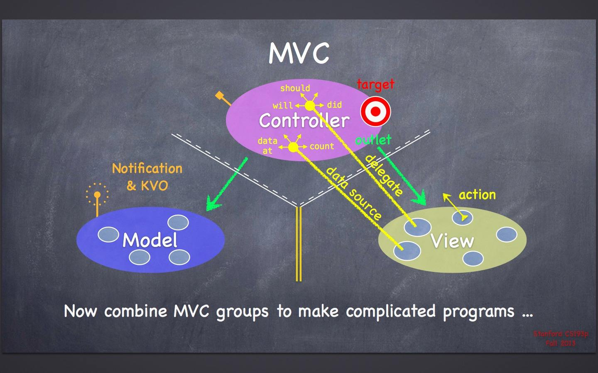

# MVC
## MVC

<p align="center">

</p>

说起MVC，必须拿斯坦福大学公开课上的这幅图来说明，这可以说是最经典和最规范的MVC标准。

> MVC在iOS中的实现思路： 一句话描述就是Controller负责将Model的数据用View渲染展示。

### MVC如何产生

APP的实质就是界面与数据的交互。

- 需要类负责界面的渲染展示，于是有了View
- 需要类负责管理数据，于是有了Model
- 我们设计的View应该能显示任意的内容，比如UILabel显示的文字应该是任意的而不只是某个特定Model的内容，**所以我们不应该在View的实现中去写和Model相关的任何代码（任何代码指的是：修改Model的逻辑不应该在View里实现，使用Model的数据渲染视图是允许的）**），如果这样做了那么View的可扩展性就相当低了。
- 同样Model只负责处理数据，不处理界面的交互，**所以Model中不应该写任何View相关代码（同样指的是：Model中不应该实现View的交互逻辑）**。
- **数据和界面应该同步**，也就是一定要有个地方要把Model的数据赋值给View，而Model内部和View的内部都不可能去写这样的代码，所以只能新创造一个类出来了，取名为Controller。


### MVC是如何工作的

上图把MVC分为三个独立的区域，并且中间用了一些线来隔开，C和V以及C和M之间的白线，一部分是虚线一部分是实线，这就表明了引用关系：**C可以直接引用V和M，而V和M不能直接引用C，而V和M之间则是双黄线，它们俩谁也不能引用谁，你既不能在M里面写V，也不能在V里面写M。**

#### 1.View与ViewController的交互


视图层最常见的事件就是按钮点击事件，实际上处理这个事件的应该是Controller，所以View把这个事件传递给了Controller。如何传递的呢，从图可以看到View上面的action，代表是事件，Controller上面的target，就是靶子，View究竟要把事件传递给谁？它被规定了传递给靶子，Controller实际上就是靶子，**View只负责传递事件，不负责关心靶子是谁。这是V和C的一种交互方式，也是Target-Action 目标-动作对设计模式。**
旁边还画出了V对C的另一种传值：协议-委托。委托有两种：代理和数据源。什么是代理，就是专门处理should、will、did事件的委托，什么是数据源，就是专门处理data、count等等的委托。

总结一下，就是主要通过三种方式：
- action-target用来负责传递特定的事件； V->C的交互
- dataSource-protocol用来通过回调的形式动态通过数据绘制界面； C->V的交互
- delegate-protocol提前约定了对一些事件的处理规则，当被规定的事件发生后，就按照协议的规定来进行处理。协议委托可以通过协议方法的参数由V向C传值。比如cell点击事件的协议方法，tableView通过indexPath参数告诉C是哪个cell被点击了。 V->C的交互

#### 2.Model与ViewController的交互

Model是数据管理者，数据可以是本地的、也可能是服务器的。拿一个简单的需求作为例子，例如我想在一个UILabel中显示一段文字，文字是网络请求获得的。

使用MVC设计模式：C中需要一个V（UIButton）作为属性显示这段文字，文字从M中获取，获取的地方在哪里呢？通常在C的生命周期里面，往往是viewDidLoad方法中调用M获取数据的方法来获取数据。M获取的数据是异步网络请求获得的，网络请求结束后，C才应该用M的数据赋值给V，那么现在如何知道网络请求结束了？
OC中有一种机制来解决这个问题“一个对象想要关系另一个对象的属性是否放生变化”的问题，**KVO**。


**KVO全称为Key Value Observing，键值监听机制，由NSKeyValueObserving协议提供支持，NSObject类继承了该协议，所以NSObject的子类都可使用该方法。让一个对象去观察另一个对象的某个键值路径所代表的属性，一旦发生了变化，那么系统会调用观察者的方法`observingValueKeyForPath:`。** 如果想在C中M的data属性发生改变之后刷新界面，那么就只需要向M添加观察者C，观察路径为@"data"。对C来讲，一旦M的data属性发生了变化，那么C的observingValueKeyForPath方法就会被调用，在方法中实现数据的传递，达到M和V同步的效果。

## MVVM

MMVM：Model、View、ViewModel。与MVC相比，多了一个ViewModel少了一个Controller。VM的意义在于数据。
Model负责对数据进行存和取，然后我们对数据除了存取，还需要**解析**操作。

### MVVM的诞生

> 举个例子：网络请求获取字典，字典作为原始数据放在Model中，Controller需要使用字典某可以key对应的一个数组，然后来用于UITableView的显示。

```swift
@objc func refreshAction(_ sender: UIRefreshControl) {
    self.model.data.removeAll()
    AF.request("https://api.seniverse.com/v3/weather/now.json?key=SJSVidYf39dI84d0s&location=shanghai&language=zh-Hans&unit=c").responseJSON { (response) in
        if let value = response.value {
            let json = JSON(value)
            if let result = json.dictionary?["results"]?[0] {
                if let dict = result.dictionary {
                    for key in dict.keys {
                        if let value = dict[key]?.dictionaryObject {
                            for key in value.keys {
                                let title = key;
                                let value = value[key];
                                let model = Model(title: title, detailTitle: value as! String)
                                self.model.data.append(model)
                                self.tableView.reloadData() // 刷新UI
                            }
                        }
                    }
                }
            }
        }
    }
    sender.endRefreshing()
}
```

<p align="center">

</p>

我们往往把数据解析的工作放在了Controller中，在之前分析的MVC如何分配工作一样，需要数据有了M，需要界面有了V，需要有一个地方同步M和V于是有了C，我们忽略了M的进一步处理数据解析的过程。

> 在MVC出生的年代，手机APP的数据往往都比较简单，没有现在那么复杂，所以那时的数据解析很可能一步就解决了，所以既然有这样一个问题要处理，而面向对象的思想就是用类和对象来解决问题，显然V和M早就被定义死了，它们都不应该处理“解析数据”的问题，理所应当的，“解析数据”这个问题就交给C来完成了。

而现在App功能越来越复杂，数据结构越来越复杂，解析数据就没那么简单，如果继续按照MVC的设计模式，将数据解析工作放在Controller里面，Controller就显得极为臃肿。然后Controller期初设计的目的并不是处理数据。

Controller的工作：
- self.view用来作为所有视图的容器
- 管理自己的生命周期
- 处理Controller之间的跳转
- 实现Controller容器

而数据解析的任务并不应该由Controller来实现，M、V、C都不应处理数据，那么由谁来负责呢？开发者为数据解析新创建一个类ViewModel。这就是MVVM的诞生。

### 如何实现MVVM

现在我们开始着手实现MVVM之前，我先简单提一下之前遗留的一个问题：为什么MVVM这个名字里面，没有Controller的出现（为什么不叫MVCVM，C去哪了）。
你只需要记住两点：

1、Controller的存在感被完全的降低了；

2、VM的出现就是Controller存在感降低的原因。

在MVVM中，Controller不再像MVC那样直接持有Model了。

想象Controller是一个Boss，数据是一堆文件（Model），如果现在是MVC，那么数据解析（比如整理文件）需要由Boss亲自完成，然而实际上Boss需要的仅仅是整理好的文件而不是那一堆乱七八糟的整理前的文件。

所以Boss招聘了一个秘书，现在Boss就不再需要管理原始数据（整理之前的文件）了，他只需要去找秘书：你帮我把文件整理好后给我。

那么这个秘书就首先去拿到文件（原始数据），然后进行整理（数据解析），接下来把整理的结果给Boss。

所以秘书就是VM了，并且Controller（Boss）现在只需要直接持有VM而不需要再持有M了。

如果再进一步理解C、VM、M之间的关系：因为Controller只需要数据解析的结果而不关心过程，所以就相当于VM把“如何解析Model”给封装起来了，C甚至根本就不需要知道M的存在就能把工作做好。

那么我们MVVM中的持有关系就是：C持有VM，VM持有M。

所以在实现MVVM中一种必要的思想就是：

一旦在实现Controller的过程中遇到任何跟Model（或者数据）相关的问题，就找VM要答案。