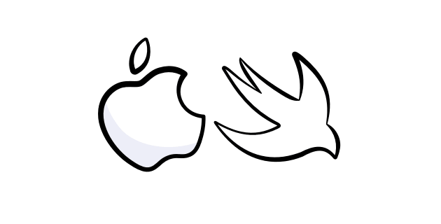

## 介绍

iOS-Tutorial是一个基于 `Objective-C`、`Swift`语言的iOS开发教程系列，包含iOS设计模式、主流框架等知识点。
该项目正在持续更新。

### 目录
- [设计模式](#设计模式)
  - [MVC](#MVC)
- [框架](#框架)
  - [ReactiveCocoa](#ReactiveCocoa)

## 设计模式

- [MVC](https://github.com/ChinaWxq/iOS-Tutorial/tree/master/Design%20Patterns) - MVC。

## 框架

- [ReactiveCocoa](https://github.com/ChinaWxq/iOS-Tutorial/tree/master/ReactiveCocoa) - ReactiveCocoa函数式响应式编程框架

## License

- 根据MIT许可证分发。