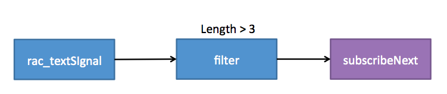
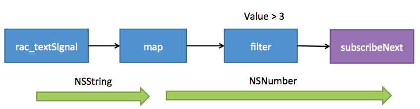
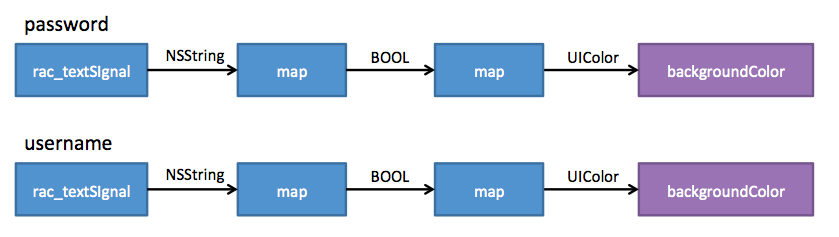
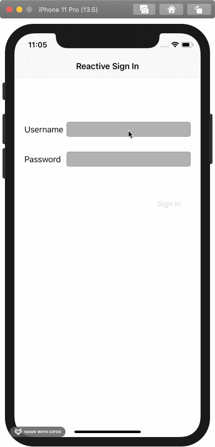

# ReactiveCocoa

## Introduction

> As an iOS developer, nearly every line of code you write is in reaction to some event; a button tap, a received network message, a property change (via Key Value Observing) or a change in user’s location via CoreLocation are all good examples. However, these events are all encoded in different ways; as actions, delegates, KVO, callbacks and others. ReactiveCocoa defines a standard interface for events, so they can be more easily chained, filtered and composed using a basic set of tools.
[资料参考](https://www.raywenderlich.com/2493-reactivecocoa-tutorial-the-definitive-introduction-part-1-2)

作为一个iOS开发者，你写的每一行代码几乎都是在相应某个事件，例如按钮的点击，收到网络消息，属性的变化（通过KVO）或者用户位置的变化（通过CoreLocation）。但是这些事件都用不同的方式来处理，比如action、delegate、KVO、callback等。[ReactiveCocoa](https://github.com/ReactiveCocoa/ReactiveCocoa)为事件定义了一个标准接口，从而可以使用一些基本工具来更容易的连接、过滤和组合。


ReactiveCocoa结合了几种编程风格：

函数式编程（Functional Programming）：使用高阶函数，例如函数用其他函数作为参数。

响应式编程（Reactive Programming）：关注于数据流和变化传播。

所以，你可能听说过ReactiveCocoa被描述为 **函数响应式编程(FRP)** 框架。

## Import ReactiveCocoa

最简单的方式是通过CocoaPods，如下操作：

在终端中进入工程目录
```
pod init
```
配置Podfile文件
```
vim Podfile 
'ReactiveCocoa', '2.1.8'
```
下载
```
pod install

你将会看到：
Analyzing dependencies
Downloading dependencies
Installing ReactiveCocoa (2.1.8)
Generating Pods project
Integrating client project
Pod installation complete! There is 1 dependency from the Podfile and 1 total pod installed.
```

> 现在ReactiveCocoa已经支持Swift，最新版本支持Swift不支持OC，如需使用OC版本需要指定pod版本。

打开.xcworkspace文件，在需要使用的文件导入。
```objc
#import <ReactiveCocoa/ReactiveCocoa.h>
```

## Use ReactiveCocoa

### Time to Play

```objc
[self.usernameTextField.rac_textSignal subsribeNext:^(id x) {
    NSLog(@"%@", x);
}];
```
每次改变文本框的文字，block中的代码就会执行，没有target-action，没有delegate，仅仅只有signal和block，就能达到监听文本框的效果，这是令人激动的！

**ReactiveCocoa signals（RACSignal）** 发送事件流给他们的（subscribers）订阅者们，他们有3中事件类型：`next`，`error`和`completed`。信号在发出error或completed事件之前可以发出任意数量的next事件。
RACSingals有很多方法订阅不同的事件类型，每个方法至少有一个闭包，当事件触发闭包里的逻辑就会执行。通过查看log，能发现每次next事件发生，`subscribeNext:`方法中的闭包就会执行。

> RACSignal的理解：是推动驱动数据的流，通过订阅来传递流。

```
2020-07-13 19:59:59.326616+0800 RWReactivePlayground[27062:617489] R
2020-07-13 19:59:59.686537+0800 RWReactivePlayground[27062:617489] Re
2020-07-13 19:59:59.946428+0800 RWReactivePlayground[27062:617489] Rea
2020-07-13 20:00:00.204268+0800 RWReactivePlayground[27062:617489] Reac
2020-07-13 20:00:01.048935+0800 RWReactivePlayground[27062:617489] React
2020-07-13 20:00:01.293494+0800 RWReactivePlayground[27062:617489] Reacti
2020-07-13 20:00:01.485799+0800 RWReactivePlayground[27062:617489] Reactiv
2020-07-13 20:00:01.890100+0800 RWReactivePlayground[27062:617489] Reactive
2020-07-13 20:00:03.264182+0800 RWReactivePlayground[27062:617489] ReactiveC
2020-07-13 20:00:04.286558+0800 RWReactivePlayground[27062:617489] ReactiveCo
2020-07-13 20:00:04.512162+0800 RWReactivePlayground[27062:617489] ReactiveCoc
2020-07-13 20:00:04.658995+0800 RWReactivePlayground[27062:617489] ReactiveCoco
2020-07-13 20:00:04.848863+0800 RWReactivePlayground[27062:617489] ReactiveCocoa
```

第一次接触看到这段代码一定是一头雾水，你肯定会问这几个问题：
1. 为什么参数x就是textField.text而不是其他内容？
2. 为什么每次textField.text发生变化，block就会执行？
3. subScribeNext方式是什么意思？

我们在`ViewController.m`文件中创建一个自定义的信号。
```objc
- (RACSignal *)createSignal {
    return [RACSignal createSignal:^RACDisposable *(id<RACSubscriber> subscriber) {
        NSLog(@"signal created");
        return nil;
    }];
}

- (void)viewDidLoad {
    RACSignal *signal = [self createSignal];
}
```
执行发现Log没有被打印出来，那闭包什么时候调用呢？
我们查看RACSignal构造方法，发现需要一个RACSubscriber对象作为函数参数，RACDisposable对象作为返回值。通过block的名字`didSubscribe`推断是RACSignal被订阅，这个block才会被触发。
```objc
// RACSignal.m 
+ (RACSignal *)createSignal:(RACDisposable * (^)(id<RACSubscriber> subscriber))didSubscribe {
	return [RACDynamicSignal createSignal:didSubscribe];
}

// RACDynamicSignal.m
+ (RACSignal *)createSignal:(RACDisposable * (^)(id<RACSubscriber> subscriber))didSubscribe {
	RACDynamicSignal *signal = [[self alloc] init];
	signal->_didSubscribe = [didSubscribe copy];
	return [signal setNameWithFormat:@"+createSignal:"];
}
```

在`viewDidLoad`方法加入以下代码：
```objc
[signal subscribeNext:^(id x) {
    NSLog(@"subScribe");
}];
```
发现打印了Log内容只有signal created，并没有subscribe。按照之前的推断是没问题，只有signal被订阅之后才会执行`disSubsribe`，那`subscribeNext`是什么时候调用呢？查看方法具体实现。

```objc
// RACSubscriber.m
- (RACDisposable *)subscribeNext:(void (^)(id x))nextBlock {
	NSCParameterAssert(nextBlock != NULL);
	
	RACSubscriber *o = [RACSubscriber subscriberWithNext:nextBlock error:NULL completed:NULL];
	return [self subscribe:o];
}

+ (instancetype)subscriberWithNext:(void (^)(id x))next error:(void (^)(NSError *error))error completed:(void (^)(void))completed {
	RACSubscriber *subscriber = [[self alloc] init];

	subscriber->_next = [next copy];
	subscriber->_error = [error copy];
	subscriber->_completed = [completed copy];

	return subscriber;
}

// 公有接口
- (void)sendNext:(id)value {
	@synchronized (self) {
		void (^nextBlock)(id) = [self.next copy];
		if (nextBlock == nil) return;

		nextBlock(value);
	}
}
```
订阅者持有是三个属性：next、error、completed闭包，也对应了信号的类型。`sendNext`方法中实现了`next`闭包的执行。在信号的生命周期中，可以发送next、error、completed是三种事件，对应了订阅者的`sendX`系列方法。

于是我们在signal生成方法中添加以下代码：
```objc
- (RACSignal *)createSignal {
    return [RACSignal createSignal:^RACDisposable *(id<RACSubscriber> subscriber) {
        NSLog(@"signal created");
        [subscriber sendNext:nil];
        return nil;
    }];
}
```
再次运行，Log内容都被打印出来了。我们基础解析了一下`RACSignal`对象和`subsribeNext`方法。
我们可以回答问题：
1. `rac_textSignal`，是`ReactiveCocoa`针对UIKit控件封装信号的一种。信号本质上监听了`textField.text`属性，当发生变化时将变化值抛出来，监听的是text属性是`rac_textSignal`创建决定的。
2. 为`rac_textSignal`创建订阅者对象，在text发生变化时，就会调用订阅者对象的`sendNext`方法，从而执行`next`闭包。
3. 为信号创建订阅者对象，根据信号监听变化，执行相应方法。

---

ReactiveCocoa框架使用Category为很多标准库UIKit控件添加信号，使你能够给他们订阅事件。
ReactiveCocoa有很多来操作符来控制事件流，假如你只对用户名长度超过6感兴趣，可以使用`fliter`运算符。
```objc
[[self.usernameTextField.rac_textSignal
  filter:^BOOL(NSString *value) {
    return value.length > 3;
  }]
  subscribeNext:^(id x) {
    NSLog(@"%@", x);
  }];

```
创建了一个简单的管道，这是响应式编程的本质，根据数据流来表达应用程序的功能。

`rac_textSignal`是原事件，数据流通过`fliter`只允许包含字符串长度大于3的事件通过，管道的最后一步是`subscribeNext:`。
`filter`的操作也是返回`RACSignal`，你可以调整代码来展示管道步骤：
```objc
RACSignal *userNameSourceSignal = self.usernameTextField.rac_textSignal;

RACSignal *filterUsername = [userNameSourceSignal filter:^BOOL(NSString *value) {
    return value.length > 3;
}];
    
[filterUsername subscribeNext:^(id x) {
    NSLog(@"%@", x);
}];
```
因为每个操作是基于`RACSignal`返回`RACSignal`，专业术语称为`fluent interface -- 流畅的接口`。这个特性允许你直接构造管道而用每一步引用本地变量。

> fluent interface，是一种API设计模式。在软件工程中，是一种面向对象的API，其设计广泛依赖于方法链，其目的是创建DSL来提高代码的可读性。

### What's An Event?

目前只描述了不同的事件类型，但没有描述事件的结构。有趣的是事件包含任何内容。
在管道中加入另一个运算：
```objc
[[[self.usernameTextField.rac_textSignal map:^id(NSString *text) {
    return @(text.length);
}] filter:^BOOL(NSNumber *length) {
    return [length integerValue] > 2;
}] subscribeNext:^(id x) {
    NSLog(@"%@", x);
}];
```
运行发现log输出的内容不再是字符串而是数字。新加的map操作使用闭包转化了事件的数据，对于接收的每个next事件，执行指定的闭包发出返回值给下一个next事件，`map`将`NSString`作为输入，取字符串长度返回`NSNumber`。


### Create Valid State Signals
实现一个逻辑，文本框是否合法来改变文本框的背景色。
```objc
RACSignal *validUsernameSignal =
  [self.usernameTextField.rac_textSignal
    map:^id(NSString *text) {
      return @([self isValidUsername:text]);
    }];

RACSignal *validPasswordSignal =
  [self.passwordTextField.rac_textSignal
    map:^id(NSString *text) {
      return @([self isValidPassword:text]);
    }];

/*
[[validPasswordSignal
  map:^id(NSNumber *passwordValid) {
    return [passwordValid boolValue] ? [UIColor clearColor] : [UIColor yellowColor];
  }]
  subscribeNext:^(UIColor *color) {
    self.passwordTextField.backgroundColor = color;
  }];
*/
RACSignal *validUsernameSignal =
  [self.usernameTextField.rac_textSignal
    map:^id(NSString *text) {
      return @([self isValidUsername:text]);
    }];

RACSignal *validPasswordSignal =
  [self.passwordTextField.rac_textSignal
    map:^id(NSString *text) {
      return @([self isValidPassword:text]);
    }];

```
ReactiveCocoa使用宏允许你更好的完成表达。`RAC`宏允许你将信号输出应用到对象的属性上，`RAC`宏有两个参数，第一个是需要设置属性值的对象，第二个是属性名，每次信号产生一个next事件，传递的值就会传递给属性。

为什么要创建两个管道呢？能否创建一个管道实现呢？

### Combining signals

```objc
RACSignal *signUpActiveSignal =
  [RACSignal combineLatest:@[validUsernameSignal, validPasswordSignal]
                    reduce:^id(NSNumber *usernameValid, NSNumber *passwordValid) {
                      return @([usernameValid boolValue] && [passwordValid boolValue]);
                    }];

```
`combineLast:reduce:`方法将两个型号聚合成一个新的信号，只要两个信号中的任意一个发出新值，`reduce`闭包就会执行，将返回值传递给next事件。
订阅
```objc
[signUpActiveSignal subscribeNext:^(NSNumber *signupActive) {
   self.signInButton.enabled = [signupActive boolValue];
 }];
```
现在的逻辑如下图所示：


你可以使用ReactiveCocoa完成一些重量级的任务：

- 分割：一个信号可以有多个Subscriber，也就是作为后续很多步骤的源，textField的Bool信号被作为`map`和`combineLastest:reduce`的输入源。
- 聚合：多个信号可以聚合成一个新的信号，`username`和`password`Bool信号聚合成一个新的信号，来实现登录文本检查的逻辑。

### Reactive Sign-in

```objc
[[[[self.signInButton
   rac_signalForControlEvents:UIControlEventTouchUpInside]
   doNext:^(id x) {
     self.signInButton.enabled = NO;
     self.signInFailureText.hidden = YES;
   }]
   flattenMap:^id(id x) {
     return [self signInSignal];
   }]
   subscribeNext:^(NSNumber *signedIn) {
     self.signInButton.enabled = YES;
     BOOL success = [signedIn boolValue];
     self.signInFailureText.hidden = success;
     if (success) {
       [self performSegueWithIdentifier:@"signInSuccess" sender:self];
     }
   }];

```

## Demo

| 内容 | 项目名 |
| --- | --- |
| 登录验证 | RACSignIn |

